# SolarPoweredSender
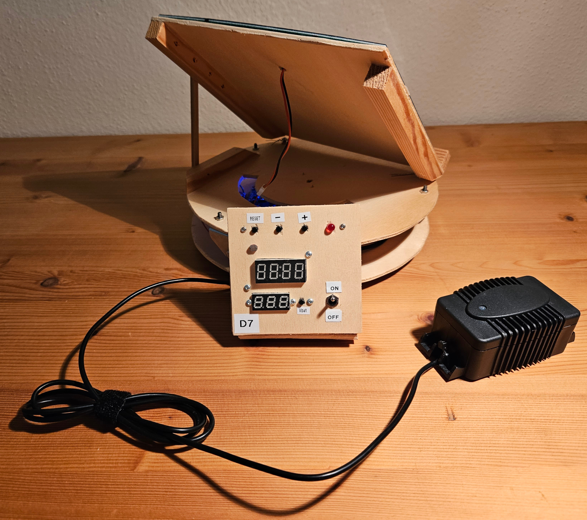

The SolarPoweredSender is a solar powered ATmega328P based DIY device to control 433 MHz ASK power outlets, like these:

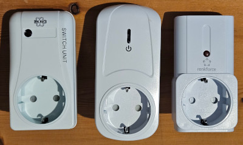
 * The power outlets can be switch on or off by a scheduler. 
 * The device gets the time via a DCF77 receiver 
 * The device is powered by a battery buffered solar panel.
 * The solar panel will rotated to the current sun position (one axis)

[See device in action on Youtube](https://youtu.be/c9qGXx8b9VA)

## License and copyright
My code is licensed under the terms of the 2-Clause BSD License [Copyright (c) 2023 codingABI](LICENSE). 

### External code
I use external code in this project in form of libraries and one small code piece 
called *summertime_EU*, but does not provide these external sources. If you want to compile my project, you should be able to download the needed libraries 

- Dusk2Dawn (by DM Kishi)
- DCF77 (by Thijs Elenbaas)
- Time (by Michael Margolis/Paul Stoffregen)
- SevenSegmentTM1637 (by Bram Harmsen)
- RCSwitch (by sui77,fingolfin)

with the Arduino IDE Library Manager. Only the library **SolarPosition** (by KenWillmott) needs to downloaded directly from https://github.com/KenWillmott/SolarPosition. For details to get the small code piece for *summertime_EU "European Daylight Savings Time calculation by "jurs" for German Arduino Forum"* see [externalCode.ino](SolarPoweredSender/externalCode.ino). 

## Hardware
 * Microcontroller ATmega328P (with 16 MHz crystal, Board manager: "Arduino UNO")   
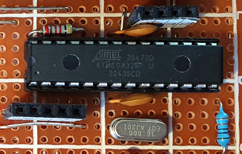
 * One red status led
 * Three push buttons (one only as a physical reset button) and one static power switch
 * Passive buzzer
 * DCF77 Time signal receive module DAEV6180B1COB   
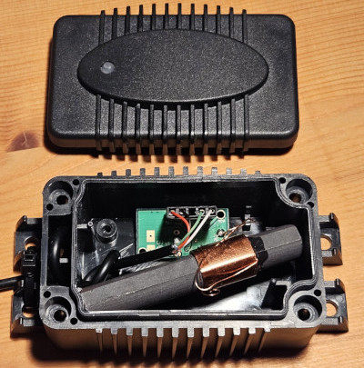
 * 433MHz sender STX882 (a FS1000A would also works)
 * TM1637 7-segment display
 * MG90S servo (The servo can rotate the solar panel up to 180 degrees)
 * MOSFET IRF9530NPBF to power on and off the servo and 7-segment display
 * 18650 Battery (3.7V, 3500mAh) with TP4056 loader and MT3608-Boost Converter to get 5V
 * HT7333-A voltage regulator to get 3.3V for the DCF77 receiver module
 * Solar panel 6V 4.5W (16.5cm x 16.5cm)
 * 433MHz power outlets (like Emil Lux 315606 from OBI, renkforce RSL366R from Conrad, Elro AB440S from OBI...)

## Used development environment 
 * Arduino IDE 1.8.19 (Without "real portable" support version 2.* makes no sense for me https://forum.arduino.cc/t/arduino-ide-2-0-portable/)
 * Arduino AVR Boards Version 1.8.6

## Device behavior
* When the device is powered on, a DCF77 time sync is started and the red led is enabled. After 10 minutes without getting a valid time, the user is prompted to input the time. If the user does not set a valid time, the device will sleep for 15 minutes, does a reset after deep sleep and the DCF77 time sync will start again.
* After getting the first valid time the device runs in normal operational mode:
  * The power outlets will be switch on or off depending on time. 
  * Between sunrise and sunset the solar panel will be rotated to the sun
  * When the environment is too dark (e.g. without sun) or battery is low the solar panel will not be rotated
  * Once per day after sunset the solar panel will be rotated in middle, "south" position (="parking position")  
  * Once per day at 04:00 the device time will be synced by a DCF77 module
  * The device time during the day is not very accurate and can drift several minutes per day, but should be accurate enough for the power outlets. The daily DCF77 time sync will clear the drift once per day.
  * When battery is low the device will not send 433 MHz signals to the power outlets
  * Once per day at 20:00 the battery voltage and runtime will be sent to my receiver project https://github.com/codingABI/SenderReceiver

## Power consumption
 * After getting a valid time the device is always 4 minutes in deep sleep, wakes up and stays active typically for about ~0.5 seconds (and longer when parking, showing status values, DCF77 sync, manual setting the time...) and goes again to deep sleep 
 * In deep sleep: ~3 mW (The MT3608-Boost converter consumes ~2mW idle power)
 * Active time: up to 1.5W, when the servo is rotating (At begin of the servo rotation for a short time also more) => C4 with 470uF helps
 * Device is still working from February 2022 until now (December 2024) only with solar power and I get no direct sun light from May to August at my device position

## Red status led
| Led | Meaning |
| :---  | :--- |
| One long blink every 16 seconds | Last DCF77 sync was not successful => weak time |
| One short blink every 8 seconds | Low battery (every 16 seconds, if last DCF77 sync was not successful) |
| Double short blink every 8 seconds | Environment light not high enough to rotate solar panel (every 16 seconds, if last DCF77 sync was not successful) |
| Continuous light for 8 seconds |  Pending WDT device reset |
| No fixed time | After device startup the red led should be enabled for about 5-60 seconds and blink afterwards once per second for some minutes. Otherwise the DCF77 signal could not be received and the DCF77 sync will timeout. |

 ## Buzzer-Codes
| Buzzer | Meaning |
| :---  | :--- |
| Standard beep | Timeout for DCF77 sync or user input |
| Laser beep  | Begin of normal device start/power on |
| Long beep  | Error (If critical, the device will be reset) |
| High short beep  | A 433 MHz signal was sent |
| Short beep  | A button was pressed to show current status values |

# Appendix

## Schematic

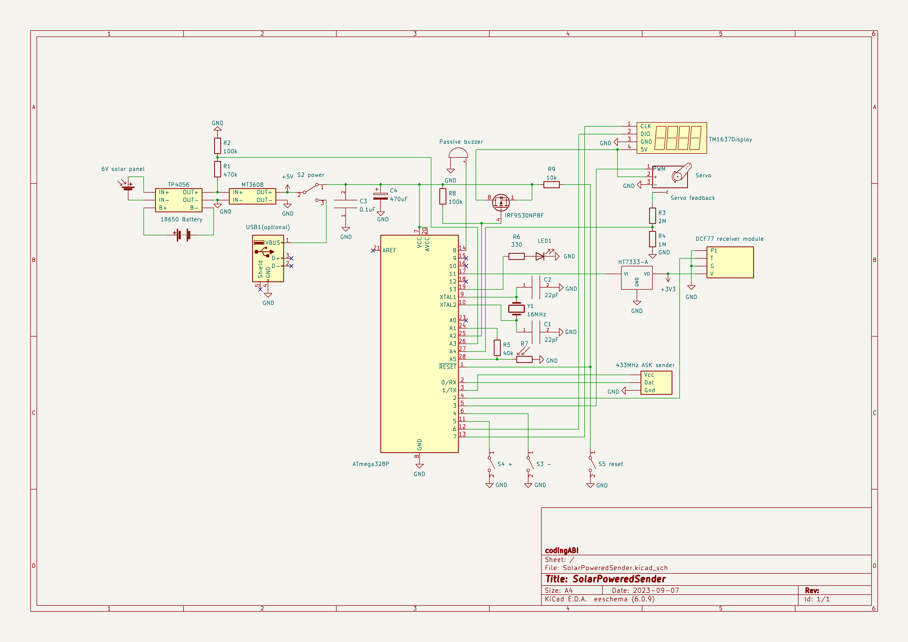

## Construction

### Base plate with perfboard
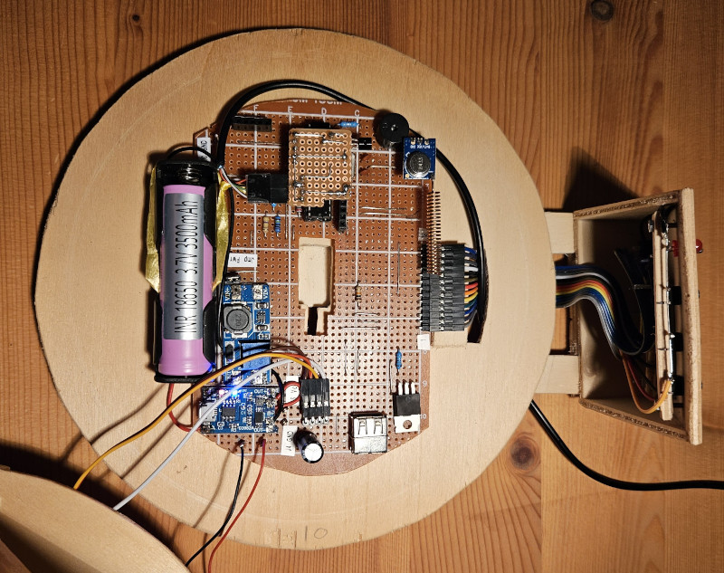

### Flipped upper plate with servo in the center
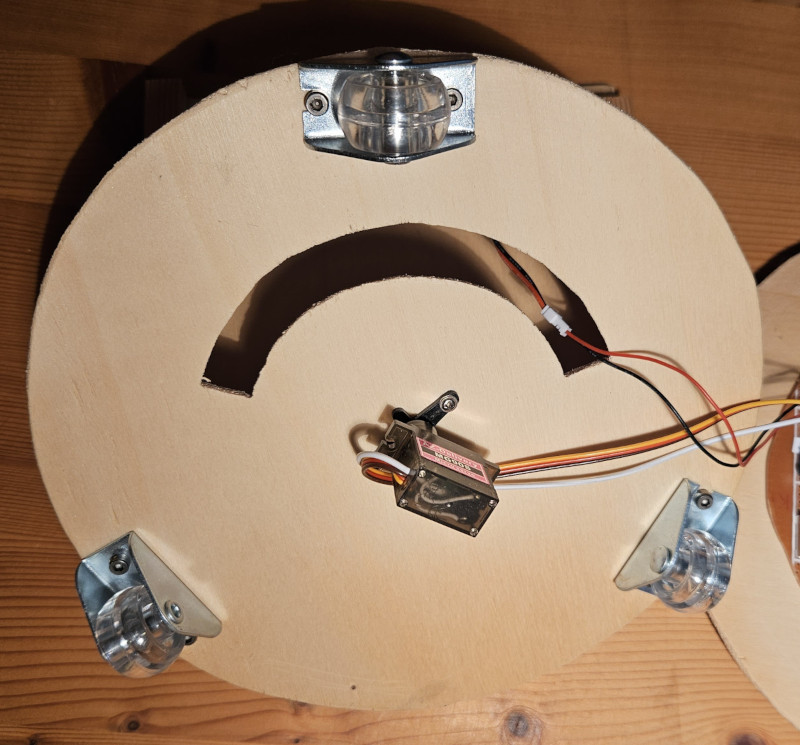

### Mounted plates
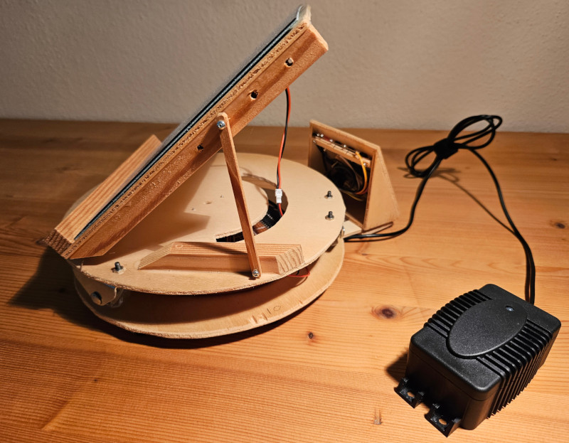

The input/display panel on the side will be orientated to the north.

## Servo feedback
The device uses a standard MG90S servo with a custom modification for a feedback line. 

The solar panel will be rotated by the servo and the normal rotation speed of the used MG90S servo is ~180°/0.3s, which is too fast for the panel. To reduce the speed the device rotates stepwise until it reaches the target orientation. This works fine, but when you power on the device, the device does not know the current orientation of the servo and this would lead to a full speed rotation to the first target orientation. To avoid this I opened the servo and soldered a line (I call it feedback line) to the internal potentiometer (Red box on the photo) of the servo.

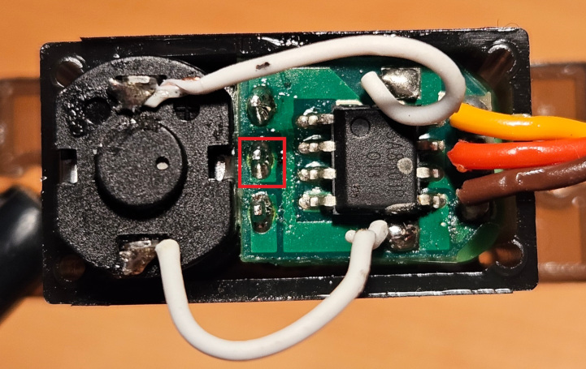

With the internal potentiometer of the servo and a high resistance voltage divider I can measure the current orientation of the servo by an analog pin and do always slow rotations with a speed of max. ~180°/22s (As good as possible. A MG90S is no high precision stepper motor).

Values on feedback line (could be different for other servos): 
| Panel/servo orientation | Analog value on A4 | Compass direction |
| :---:   | :---: | :---: |
| 0° | 857 | East |
| 90° | 470 | South |
| 180° | 82 | West |

If needed, you can [calibrate](#servo-calibration) the feedback line to the used servo. 
 
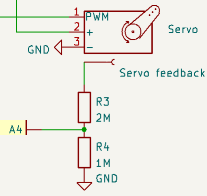

## Set the time manually
When you press both pushbuttons "+" and "-" at the same time in normal operational mode or while a DCF77 sync, the device enables the 7-segment display and you can change the local device time. You will be prompted to set minute, hour, year... one after another. To change the value you can use the push button "+" or "-". When you press both pushbuttons "+" and "-" at the same time or after a timeout of 10 seconds, the value will be set and you will be prompted for the next value. You input the time in local Germany time and the time will be converted automatically to UTC, because the device time internally runs in UTC.

A time earlier then 31.12.2001 will be ignored and will not be set for the device.

### Initial flashing
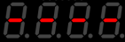

### Input minute


### Input hour


### Input year


### Input month


### Input day


## Display status values
When you press one of the pushbuttons "+" or "-" in normal operational mode, the device wakes up, enables the 7-segment display and show you some status values. Each value will be display for one second and after the last value the display will be disabled and the device will sleep again.

### Initial flashing


### Current device local time


### Voltage of battery in mV 


While charging (Between sunrise and sunset with enough sun light) this voltage is the battery charging voltage. If you want to see the battery voltage start displaying the status values after sunset.

### Current value for the light dependent resistor LDR


### Nonstop device runtime in days


When the device is powered on and gets the first time (By DCF77 or manually set) this time will be set as boot time. The difference between the current time and the boot time will be shown here as runtime. When due a DCF77 sync or you manually set the time for a running device to a time before the boot time this time will be set as boot time.  

### Target solar panel orientation 


Calculated target panel [orientation](#panel-orientation) (=azimuth-90°) 

### Measured solar panel orientation 


Solar panel [orientation](#panel-orientation) measured by feedback line.

### Last solar panel orientation 


Last actively used panel [orientation](#panel-orientation). If this value is not displayed, the device has not performed a solar panel rotation since startup.

### Servo calibration
When you press pushbutton "+" or "-" during the last displayed status value, the device will start a servo calibration. The servo calibration rotates the panel to 0, 180 and 90 degree and will calibrate the server feedback line. This can increase the uniformity of the servo rotation speed and is needed if you do not use a MG90S servo. 

## Panel/servo orientation

The device uses an orientation of 0° for direction east. 

| Panel/servo orientation | Compass direction |
| :---: | :---: |
| 0° | East |
| ... | ... |
| 90° | South |
| ... | ... |
| 180° | West |

## Notes

### Voltage regulator HT7333-A without capacitors?
The HT7333-A voltage regulator should be use with capacitors on input and output side. I do not use these capacitors because I had to less space and it worked for me without the capacitors.

### Why pin 0, 1?

The decision to use pin 0 and 1 was made because the perfboard was originally made without the 433Mhz sender and these two pins were free and reachable, when the sender was needed.

If I would make a new perfboard, I would 
 * use pin 9 for RCSWITCH_PIN_DAT 
 * connect Vcc of the sender to Vcc of the 7-segment display and the servo

=> This would make pin 0 and 1 free for "Serial.print"

### Why pin 11?

The decision to use pin 11 was made because the perfboard was originally made without the DCF77 receiver and this pin was free and reachable, when the DCF77 receiver was needed.

If I would make a new perfboard, I would 
 * use pin 10 for DCF77_PIN_VCC

=> This would free pin 11 which is in use while flashing the device

### Second 7-segment display and pushbutton "Vbat"?

The second 7-segment display and pushbutton "Vbat" visible on the photos are optional and have nothing to do with the ATmega328P circuit. The second 7-segment display is an autonomous voltmeter and the pushbutton "Vbat" connects the voltmeter to the battery => The battery voltage can be displayed every time without the help of the ATmega328P.

### error: 'now' was not declared in this scope
If you get this error when compiling

```
...\libraries\DCF77\DCF77.cpp: In static member function 'static void DCF77::finalizeBuffer()':
...\libraries\DCF77\DCF77.cpp:160:21: error: 'now' was not declared in this scope
   filledTimestamp = now();...*/
```

you have to insert *#include <TimeLib.h>* after the existing line *#include <Time.h>* in libraries\DCF77\DCF77.h like here
```
#ifndef DCF77_h
#define DCF77_h

#if ARDUINO >= 100
#include <Arduino.h> 
#else
#include <WProgram.h> 
#endif
#include <Time.h>
#include <TimeLib.h> // Prevents compiler error: 'now' was not declared in this scope

#define MIN_TIME 1334102400     // Date: 11-4-2012
```

### 'summertime_EU' was not declared in this scope
You forget to download some code. See [externalCode.ino](SolarPoweredSender/externalCode.ino) for details and how to fix it.
